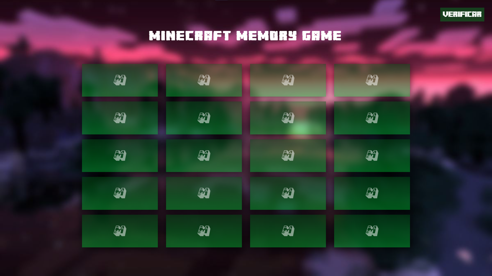

<h1 align="center" >Minecraft Memory Game</h1>

This is a Memory Game of Minecraft. Desenvolved by me for practice javascript function.

<figure>
  </img>
</figure>

 

<figure>
  </img>
</figure>

 

<a align="center" href="https://gabrielwaltmann.github.io/memory-game" target="_blank">
  <h3 align="center">TEST WEBSITE
</a>

 

# Technologies

<table align="center">
  <tr>
    <td>HTML</td>
    <td>CSS</td>
    <td>JAVASCRIPT</td>

  </tr>

</table>

# Fields <!-- Campos -->
+ Game Screen
+ Winner Screen

 

# Features
- [X] create cards function
- [X] rotate function
- [X] Loyalty
- [ ] Two player function
- [X] "Misssing cards" alert
- [X] Cards animations
- [ ] Timer function
- [X] Check winner function

# Author

 Made by Gabriel Waltmann <a href="https://www.linkedin.com/in/gabriel-waltmann-236114232/">See my Linkedin</a>